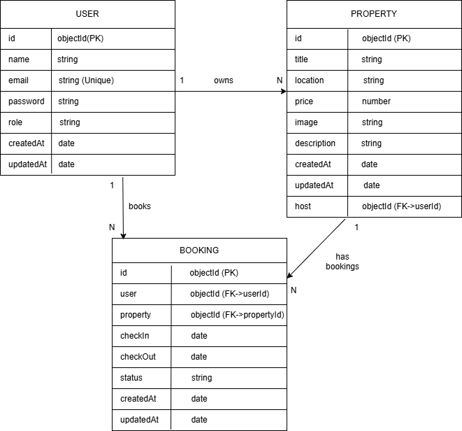

# HomeStay

HomeStay is a full-stack MERN web application developed as part of the **AI-Assisted Full Stack Web Development Internship**. The application allows users to browse rental properties through a modern React frontend while an Express.js backend provides REST APIs. Property data is stored persistently using **MongoDB Atlas** and managed with **Mongoose ODM**.

---

# Tech Stack

## Frontend

- React
- Vite
- Tailwind CSS
- React Router

## Backend

- Node.js
- Express.js

## Database

- MongoDB Atlas
- Mongoose ODM

## Deployment

- Frontend: Vercel
- Backend: Render
- Database: MongoDB Atlas

---

# Project Structure

```text
homeStay/
│
├── assets/
│   └── DatabaseSchema.png
│
├── src/
│   ├── assets/
│   ├── components/
│   ├── layouts/
│   ├── pages/
│   ├── routes/
│   └── services/
│
├── public/
│
├── backend/
│   ├── config/
│   ├── controllers/
│   ├── middleware/
│   ├── models/
│   ├── routes/
│   ├── data/
│   ├── server.js
│   ├── seed.js
│   ├── package.json
│   └── .env.example
│
├── package.json
└── README.md
```

---

# Installation

Clone the repository

```bash
git clone https://github.com/NainaKharola/homeStay.git
```

Move into the project folder

```bash
cd homeStay
```

---

# Frontend Setup

Install frontend dependencies

```bash
npm install
```

Run the frontend

```bash
npm run dev
```

Frontend runs on

```text
http://localhost:5173
```

---

# Backend Setup

Navigate to the backend folder

```bash
cd backend
```

Install backend dependencies

```bash
npm install
```

Create a `.env` file inside the backend folder

```env
PORT=5000
MONGODB_URI=your_mongodb_connection_string
```

Start the backend

```bash
npm run dev
```

or

```bash
npm start
```

Backend runs on

```text
http://localhost:5000
```

---

# Environment Variables

Create a `.env` file inside the **backend** folder.

```env
PORT=5000
MONGODB_URI=your_mongodb_connection_string
```

> **Important:** Never commit your `.env` file or database credentials to GitHub.

---

# Database

The HomeStay application uses **MongoDB Atlas** as its cloud-hosted database and **Mongoose** as the ODM (Object Data Modeling) library.

### Current Collections

- User *(planned)*
- Property
- Booking *(planned)*

### Database Features

- Persistent cloud storage
- MongoDB Atlas integration
- Mongoose schema validation
- Full CRUD operations
- Fast document queries
- Environment variable support

---

# Database Schema

The HomeStay application is designed around three primary entities.

### Collections

- User
- Property
- Booking

### Relationships

- One User can own multiple Properties.
- One User can create multiple Bookings.
- One Property can have multiple Bookings.



---

# REST API Endpoints

| Method | Endpoint | Description |
|--------|----------|-------------|
| GET | `/api/properties` | Get all properties |
| GET | `/api/properties/:id` | Get property by ID |
| POST | `/api/properties` | Create a property |
| PUT | `/api/properties/:id` | Update a property |
| DELETE | `/api/properties/:id` | Delete a property |
| GET | `/api/properties/search?q=` | Search properties |

---

# Features

- Responsive React frontend
- RESTful Express API
- MongoDB Atlas integration
- Mongoose ODM
- Complete CRUD operations
- Property search functionality
- Centralized error handling
- Input validation
- Environment variable support
- CORS configuration
- Persistent database storage
- Cloud deployment

---

# Deployment

## Frontend (Vercel)

https://home-stay-liard-ten.vercel.app

## Backend (Render)

https://homestay-mni0.onrender.com

## Database

MongoDB Atlas

---

# Future Improvements

- User Authentication
- Login & Registration
- JWT Authentication
- Password Hashing (bcrypt)
- User Roles (Guest, Host, Admin)
- Protected Routes
- User Dashboard
- Host Dashboard
- Booking System
- Reviews & Ratings
- Wishlist
- Payment Integration
- Admin Dashboard

---

# Author

Developed as part of the **AI-Assisted Full Stack Web Development Internship** using the MERN Stack.